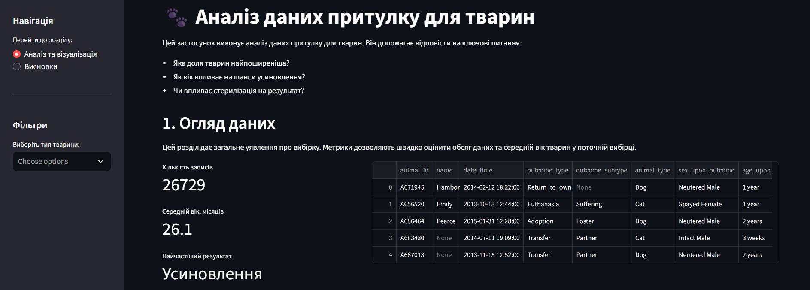

# Аналіз показників притулку для тварин

Інтерактивний вебзастосунок для аналізу даних притулку для тварин. Проєкт виконано в рамках лабораторної роботи.


## Дані
Дані взято з Kaggle: [Shelter Animal Outcomes](https://www.kaggle.com/competitions/shelter-animal-outcomes/)

## Встановлення

1. **Підготовка**

Переконайтеся, що у вас встановлено Python та Git

2. **Клонування репозиторію**
```bash
git clone https://github.com/valeriia-nedashkivska/animal-analysis.git
cd animal-analysis
```

3. **Встановлення залежностей**
```bash
pip install -r requirements.txt
```

4. **Запуск застосунку**
```bash
streamlit run app.py
```